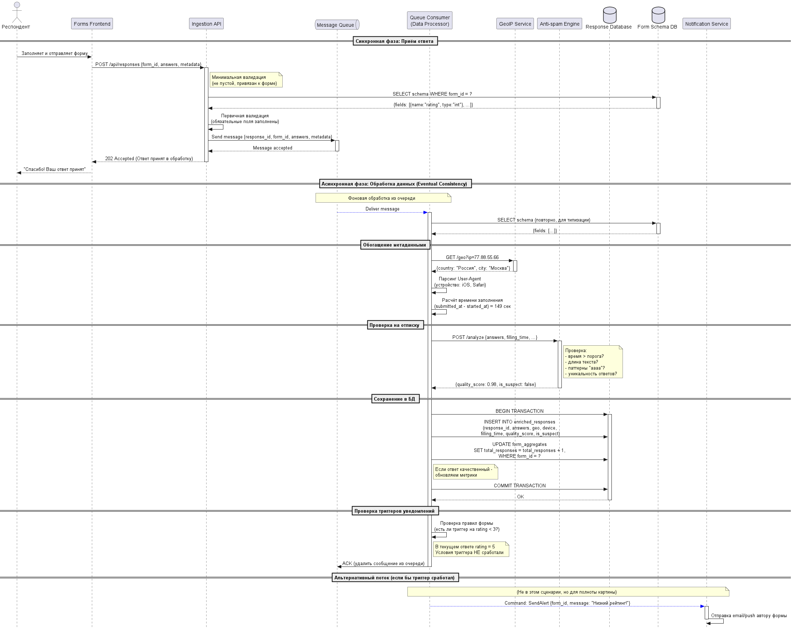
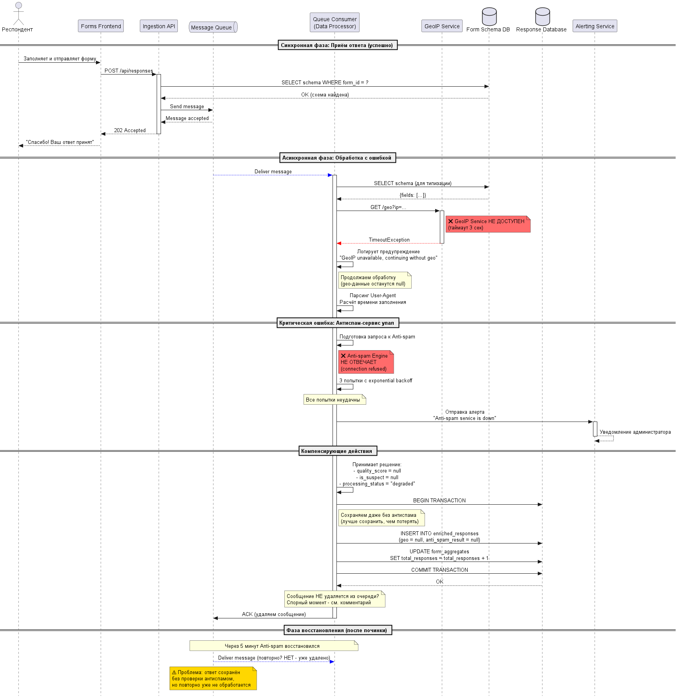

<p align="center">Министерство образования Республики Беларусь</p>
<p align="center">Учреждение образования</p>
<p align="center">"Брестский Государственный технический университет"</p>
<p align="center">Кафедра ИИТ</p>
<br><br><br><br><br><br>
<p align="center"><strong>Лабораторная работа №1</strong></p>
<p align="center"><strong>По дисциплине:</strong> "Проектирование интернет-систем"</p>
<p align="center"><strong>Тема:</strong> "Сценарий транзакции: моделирование use-case и границ ответственности"</p>
<br><br><br><br><br><br>
<p align="right"><strong>Выполнил:</strong></p>
<p align="right">Студент 3 курса</p>
<p align="right">Группы ПО-13</p>
<p align="right">&lt;Кот А. С.&gt;</p>
<p align="right"><strong>Проверил:</strong></p>
<p align="right">Несюк А.Н.</p>
<br><br><br><br><br>
<p align="center"><strong>Брест 2026</strong></p>

---

## Цель работы

Научиться анализировать бизнес-процессы интернет-системы, выявлять границы ответственности компонентов и моделировать транзакционные сценарии с учётом возможных сбоев.

---

## Вариант №10 - Формы «Откликнись» ✅
**Питч:** _Соберём ответы, а не отписки._

**Ядро домена:** _Конструктор форм, Типы полей, Ответы, Публичные ссылки, Отчёты_

---

## Ход выполнения работы

### 1. Структура проекта

```
lab-01/
├── README.md               # Основной отчёт (этот документ)
├── use-case.md             # Текстовое описание 
├── diagrams/
│   ├── sequence-happy.puml # PlantUML для успешного сценария
│   ├── sequence-happy.png  # Экспорт диаграммы
│   ├── sequence-error-payment.puml
│   └── sequence-error-payment.png
├── scenarios.feature       # Gherkin-сценарии
└── analysis.md             # Анализ границ ответственности
```

---

### 2. Use-case описание

👉 **Ссылка на файл:** [use-case.md](use-case.md)

**Основной сценарий:** _Автоматическая обработка и классификация ответа_

**Первичный актор:** _Система_

**Цель:** _Входящий ответ респондента классифицирован как «качественный» или «отписка», обогащен контекстными метаданными (гео, устройство, время) и доступен для построения аналитических отчетов._

**Краткое описание основного потока:**
1. Обработчик очереди получает событие «Новый сырой ответ» из очереди.
2. Обработчик извлекает пакет с `response_id`, `form_id`, `answers` и `metadata`.
3. Обработчик запрашивает из БД схему формы для валидации типов полей.
4. Обработчик валидирует каждый ответ под тип поля (число, текст, рейтинг).
5. Обработчик обращается к Гео-сервису для определения страны и города по IP.
6. Обработчик парсит User-Agent для определения устройства (мобильный/десктоп, ОС, браузер).
7. Обработчик вычисляет время заполнения (`submitted_at` - `started_at`).
8. Обработчик передаёт данные в Антиспам-движок для проверки качества.
9. Антиспам-движок возвращает `quality_score` и флаг `is_suspect`.
10. Обработчик сохраняет обогащённые данные в Базу данных ответов.
11. Обработчик проверяет триггеры уведомлений для этой формы.
12. Обработчик удаляет обработанное сообщение из очереди.
13. Система логирует успешную обработку с метриками.

**Альтернативные потоки:**
- 5a. Гео-сервис недоступен
- 9а. Ответ признан подозрительным (отписка)
- 11a. Сработал триггер уведомления

**Исключительные ситуации:** _[Перечислить основные ошибки]_
- 2a. Схема формы не найдена в БД
- 4a. Несоответствие типов данных
- 10a. База данных ответов недоступна
---

### 3. Диаграммы последовательности (Sequence Diagrams)

#### 3.1. Happy Path (успешный сценарий)

👉 **PlantUML исходник:** [sequence-happy.puml](diagrams/sequence-happy.puml)



## Описание потока

Поток разделён на две фазы: **синхронную** (респондент получает мгновенный ответ) и **асинхронную** (фоновая обработка через очередь сообщений).

**Синхронная фаза:**
1. Респондент заполняет форму и нажимает «Отправить»
2. Forms Frontend отправляет POST-запрос в Ingestion API
3. Ingestion API проверяет существование схемы формы в Form Schema DB
4. Ingestion API выполняет первичную валидацию (обязательные поля заполнены)
5. Ingestion API отправляет сообщение в Message Queue и получает подтверждение
6. Ingestion API возвращает клиенту статус 202 Accepted
7. Forms Frontend показывает респонденту сообщение «Спасибо! Ваш ответ принят»

**Асинхронная фаза:**
8. Message Queue доставляет сообщение Queue Consumer (Data Processor)
9. Queue Consumer запрашивает схему формы из Form Schema DB (повторно, для типизации)
10. Queue Consumer обогащает ответ: запрашивает гео-данные у GeoIP Service по IP-адресу
11. Queue Consumer парсит User-Agent для определения устройства, ОС и браузера
12. Queue Consumer вычисляет время заполнения (submitted_at - started_at)
13. Queue Consumer отправляет данные в Anti-spam Engine для проверки качества
14. Anti-spam Engine возвращает quality_score и флаг is_suspect
15. Queue Consumer открывает транзакцию в Response Database
16. Queue Consumer сохраняет обогащённый ответ и обновляет агрегаты формы
17. Queue Consumer подтверждает коммит транзакции
18. Queue Consumer проверяет триггеры уведомлений (в данном сценарии условия не сработали)
19. Queue Consumer отправляет ACK в Message Queue (сообщение удаляется)

## Участники

| Участник | Тип | Роль в потоке |
|----------|-----|---------------|
| Респондент | Актор | Заполняет и отправляет форму |
| Forms Frontend | Компонент системы | Отвечает за UI и отправку данных в API |
| Ingestion API | Компонент системы | Принимает ответы, валидирует, кладёт в очередь |
| Message Queue | Компонент системы | Буферизирует сообщения для асинхронной обработки |
| Queue Consumer (Data Processor) | Компонент системы | Забирает сообщения из очереди, выполняет обогащение и классификацию |
| Form Schema DB | База данных | Хранит схемы форм (типы полей, правила валидации) |
| GeoIP Service | Внешний сервис | Определяет страну и город по IP-адресу |
| Anti-spam Engine | Компонент системы | Анализирует ответ на признаки отписки |
| Response Database | База данных | Хранит обогащённые ответы и агрегаты форм |
| Notification Service | Компонент системы | Отправляет уведомления автору формы (при срабатывании триггеров) |

## Синхронные vs Асинхронные операции

| Операция | Тип | Причина |
|----------|-----|---------|
| POST /api/responses | Синхронная | Респондент должен получить подтверждение |
| Запрос схемы в Form Schema DB | Синхронная | Нужна для первичной валидации |
| Отправка в Message Queue | Синхронная | Гарантия, что сообщение принято |
| Доставка из очереди в Consumer | Асинхронная | Разделение по времени, не блокирует пользователя |
| Запрос к GeoIP Service | Асинхронная | Может быть медленным, не блокирует ответ пользователю |
| Проверка антиспамом | Асинхронная | Требует вычислений, не критична для приёма |
| Сохранение в Response Database | Асинхронная | Тяжёлая операция с транзакцией |
| Отправка уведомлений | Асинхронная | Не влияет на факт принятия ответа |

## Особенности архитектуры

1. **Разделение на фазы:** Респондент не ждёт завершения тяжёлых операций (гео, антиспам, сохранение)

2. **Отказоустойчивость:** Если GeoIP Service или Anti-spam Engine недоступны, ответ не теряется — остаётся в очереди

3. **Масштабируемость:** Queue Consumer может быть запущен в нескольких экземплярах для параллельной обработки

4. **Идемпотентность:** Повторная доставка сообщения из очереди не создаёт дубликаты благодаря уникальному response_id

## Ключевые решения, отражённые на диаграмме

- **Статус 202 Accepted** вместо 200 OK — явно говорит клиенту, что обработка будет асинхронной
- **Двукратный запрос схемы** (в Ingestion и Consumer) — разделение ответственности: Ingestion проверяет обязательность полей, Consumer — типы данных
- **Транзакция в Response Database** — гарантия, что ответ и агрегаты обновляются атомарно
- **ACK только после успешного сохранения** — если сохранение упало, сообщение вернётся в очередь для повторной попытки

#### 3.2. Error Case (сценарий с ошибкой)

👉 **PlantUML исходник:** [sequence-error-payment.puml](diagrams/sequence-error-payment.puml)



**Описание потока:**
Поток демонстрирует поведение системы при недоступности внешних сервисов. Ключевое решение: **продолжать обработку, если ошибка не критична**, но **алертить администратора**.

**Синхронная фаза (успешная):**
1. Респондент заполняет и отправляет форму
2. Forms Frontend отправляет POST-запрос в Ingestion API
3. Ingestion API проверяет схему формы в Form Schema DB (успешно)
4. Ingestion API отправляет сообщение в Message Queue и получает подтверждение
5. Ingestion API возвращает статус 202 Accepted
6. Forms Frontend показывает респонденту «Спасибо! Ваш ответ принят»

**Асинхронная фаза (с ошибками):**
7. Queue Consumer получает сообщение из очереди
8. Queue Consumer успешно запрашивает схему формы из Form Schema DB

9. **ОШИБКА №1:** GeoIP Service не отвечает (таймаут 3 секунды)
   - Consumer ловит TimeoutException
   - Логирует предупреждение
   - Продолжает обработку (geo-данные останутся null)

10. Queue Consumer парсит User-Agent и вычисляет время заполнения (успешно)

11. **ОШИБКА №2:** Anti-spam Engine недоступен (connection refused)
    - Consumer делает 3 попытки с exponential backoff
    - Все попытки неудачны
    - Consumer отправляет алерт в Alerting Service
    - Администратор получает уведомление о падении сервиса

12. **Компенсирующее решение:**
    - Consumer присваивает quality_score = null, is_suspect = null
    - Consumer помечает processing_status = "degraded"
    - Consumer сохраняет ответ в БД (без результатов антиспама)
    - Consumer подтверждает удаление сообщения из очереди (ACK)

**Пост-обработка:**
13. Через 5 минут Anti-spam Engine восстанавливается
14. Но сообщение уже удалено из очереди — ответ остаётся без классификации

## Участники

| Участник | Тип | Роль в потоке |
|----------|-----|---------------|
| Респондент | Актор | Заполняет и отправляет форму |
| Forms Frontend | Компонент системы | UI для отправки данных |
| Ingestion API | Компонент системы | Принимает ответы, кладёт в очередь |
| Message Queue | Компонент системы | Буферизирует сообщения |
| Queue Consumer (Data Processor) | Компонент системы | Обрабатывает ответ, обрабатывает ошибки |
| Form Schema DB | База данных | Хранит схему формы |
| GeoIP Service | Внешний сервис | ❌ НЕДОСТУПЕН (таймаут) |
| Response Database | База данных | Хранит обогащённые ответы |
| Alerting Service | Компонент системы | Отправляет алерты администратору |
| Anti-spam Engine | Компонент системы | ❌ НЕДОСТУПЕН (connection refused) |

## Ошибки и стратегии обработки

| Ошибка | Тип | Стратегия | Результат |
|--------|-----|-----------|-----------|
| GeoIP Service timeout | Не критическая | Логировать, продолжать с null | Ответ сохранён без гео-данных |
| Anti-spam Engine недоступен | Критическая | Retry 3 раза → алерт → degraded mode | Ответ сохранён без классификации |
| Обе ошибки одновременно | Деградация | Сохраняем минимально возможные данные | Статус "degraded" в БД |

## Ключевые архитектурные решения

### Решение №1: Продолжать обработку при некритичных ошибках
- **Почему:** Geo-данные — это nice-to-have, а не must-have
- **Цена:** В отчётах будет меньше контекста
- **Выгода:** Респондент не теряет свой ответ

### Решение №2: Не блокировать очередь из-за падения антиспама
- **Почему:** Если антиспам умер на час, очередь забьётся миллионами сообщений
- **Цена:** Некоторые ответы останутся без классификации
- **Выгода:** Система остаётся живой, остальные функции работают

### Решение №3: ACK даже при ошибке антиспама
- **⚠️ Оспариваемое решение:** Сообщение удаляется, даже если антиспам не отработал
- **Альтернатива:** Не делать ACK, сообщение вернётся в очередь
- **Проблема альтернативы:** При долгом падении антиспама — бесконечные ретраи с экспоненциальной задержкой

## Недостатки текущего подхода (и как их исправить)

| Недостаток | Риск | Решение |
|------------|------|---------|
| ACK при ошибке антиспама | Ответ никогда не будет классифицирован | Сохранять ответ в отдельную таблицу «на дообработку» и пересчитывать фоном после починки |
| Нет idempotent replay | Повторная доставка создаст дубликат | Использовать unique constraint на response_id в БД |
| Алерт при падении антиспама | Администратор может пропустить | Добавить paging-интеграцию (PagerDuty/Opsgenie) |


### 4. Gherkin-сценарии

👉 **Ссылка на файл:** [scenarios.feature](scenarios.feature)

**Реализовано сценариев:** _28_

**Список сценариев:**
1. ✅ **Успешный сценарий** (Happy Path) — качественный ответ успешно обработан
2. ✅ **Ошибка:** Слишком быстрое заполнение (filling_time_too_short)
3. ✅ **Ошибка:** Повторяющиеся символы (repeating_chars_only)
4. ✅ **Ошибка:** Слишком короткие текстовые поля (text_too_short)
5. ✅ **Уведомление:** Низкая оценка вызывает мгновенное уведомление автора
6. ✅ **Уведомление:** Высокая оценка НЕ вызывает уведомление
7. ✅ **Ошибка:** Схема формы не найдена (orphan_response)
8. ✅ **Ошибка:** Несоответствие типа данных (malformed)
9. ✅ **Ошибка:** Отсутствует обязательное поле
10. ✅ **Сбой:** Гео-сервис недоступен — продолжение обработки
11. ✅ **Сбой:** Антиспам-движок недоступен — degraded mode
12. ✅ **Сбой:** База данных недоступна — сообщение остаётся в очереди
13. ✅ **Сбой:** База данных недоступна — исчерпаны ретраи → Dead Letter Queue
14. ✅ **Сбой:** Очередь сообщений недоступна — HTTP 503
15. ✅ **Идемпотентность:** Повторная обработка не создаёт дубликат
16. ✅ **Граница:** Время заполнения ровно на пороговом значении
17. ✅ **Граница:** Пустое необязательное поле
18. ✅ **Граница:** Дополнительные поля, не описанные в схеме
19. ✅ **Граница:** Максимальный объём текста (10000 символов)
20. ✅ **Граница:** Минимальная оценка с осмысленным комментарием
21. ✅ **Тяжёлый ответ:** Ответ содержит файл (фото/документ)
22. ✅ **Аудит:** Все действия логируются с timestamp
23. ✅ **Метрики:** Сбор метрик для мониторинга
24. ⚠️ **TODO:** Пограничный quality_score (0.45) — отписка или ручная модерация?
25. ⚠️ **TODO:** Переобучение антиспама на основе ручных правок?
26. ⚠️ **TODO:** GDPR и хранение IP-адресов (срок хранения, анонимизация)

**Пример сценария:**
```gherkin
Feature: Автоматическая обработка и классификация ответов

  @happy-path
  Scenario: Успешная обработка качественного ответа
    Given в очереди сообщений есть сырой ответ со следующими данными:
      | response_id | form_id | answers                          | ip_address   |
      | RESP-12345  | FORM-42 | {"rating": 5, "comment": "Супер!"} | 77.88.55.66 |
    And форма FORM-42 имеет схему с полем "rating" типа "integer"
    And минимальный порог времени заполнения = 30 секунд
    And время заполнения ответа = 149 секунд
    When Обработчик очереди забирает сообщение
    Then Антиспам-движок возвращает quality_score = 0.98, is_suspect = false
    And Обработчик сохраняет обогащённый ответ в Базу данных
    And Обработчик обновляет агрегаты формы (+1 ответ)
    And Обработчик удаляет сообщение из очереди
```

---

### 5. Анализ границ ответственности

👉 **Ссылка на файл:** [analysis.md](analysis.md)

#### 5.1. Транзакционные границы

| Операция | Синхронная/Асинхронная | Откат при ошибке | Retry-стратегия | Идемпотентность |
|----------|------------------------|------------------|-----------------|-----------------|
| Валидация обязательных полей | Синхронная | Нет (просто возврат ошибки) | N/A | Да |
| Проверка существования формы | Синхронная | Нет | N/A | Да |
| Отправка сообщения в Message Queue | Синхронная | Нет (ошибка → 503) | 3 попытки с задержкой 100ms | Да (unique message_id) |
| Получение схемы формы из БД | Асинхронная | Да (ROLLBACK транзакции) | Нет (часть транзакции) | Да |
| Запрос к GeoIP Service | Асинхронная | Нет (продолжаем с null) | 1 попытка, таймаут 3 сек | Да |
| Запрос к Anti-spam Engine | Асинхронная | Нет (degraded mode) | 3 попытки с exponential backoff (500ms, 1s, 2s) | Да |
| Сохранение ответа в БД | Асинхронная | Да (ROLLBACK транзакции) | Нет | Да (unique constraint) |
| Обновление агрегатов формы | Асинхронная | Да (в той же транзакции) | Нет | Да (upsert) |
| Публикация событий (transactional outbox) | Асинхронная | Да (в той же транзакции) | Отдельный worker читает outbox | Да (unique event_id) |
| Отправка уведомлений автору | Асинхронная (отдельный worker) | Нет | 5 попыток с exponential backoff (1s, 2s, 4s, 8s, 16s) | Да (дедупликация) |
| Обновление аналитических витрин | Асинхронная (CDC) | Нет | Автоматически (Debezium/Kafka) | Да |
| Отправка вебхуков | Асинхронная | Нет | 5 попыток, затем DLQ | Да (X-Event-Id) |

#### 5.2. Обработка исключительных ситуаций

**Реализовано стратегий обработки:** 5

**Примеры:**

##### Исключительная ситуация 1: GeoIP Service недоступен

- **Условие возникновения:** Сервис геолокации не отвечает (таймаут 3 секунды, connection refused)
- **Обнаружение:** TimeoutException при вызове внешнего API
- **Реакция:** Логируем предупреждение, продолжаем обработку без гео-данных
- **Компенсация:** Поля `geo_country` и `geo_city` остаются NULL, добавляем флаг `geo_enrichment_failed: true`
- **Уведомление пользователя:** Нет (внутренняя операция, респондент уже получил 202 Accepted)

##### Исключительная ситуация 2: Anti-spam Engine недоступен

- **Условие возникновения:** Сервис детекции отписок не отвечает (connection refused, таймаут 5 секунд)
- **Обнаружение:** ConnectionException после 3 попыток с exponential backoff
- **Реакция:** Отправка алерта администратору, сохранение ответа в degraded режиме
- **Компенсация:** `quality_score = NULL`, `is_suspect = NULL`, `processing_status = "degraded"`
- **Уведомление пользователя:** Нет (ответ сохранён без классификации)

##### Исключительная ситуация 3: База данных недоступна (асинхронная фаза)

- **Условие возникновения:** Response Database не отвечает (connection refused, таймаут)
- **Обнаружение:** DatabaseConnectionException при попытке COMMIT транзакции
- **Реакция:** ROLLBACK транзакции, сообщение НЕ удаляется из очереди
- **Компенсация:** Нет (ничего не было сохранено). После 5 неудачных попыток → отправка в Dead Letter Queue
- **Уведомление пользователя:** Нет (респондент уже получил 202 Accepted)

##### Исключительная ситуация 4: Схема формы не найдена

- **Условие возникновения:** В запросе указан `form_id`, которого нет в Form Schema DB
- **Обнаружение:** Запрос к БД вернул пустой результат
- **Реакция:** Помещение сообщения в Dead Letter Queue с тегом `orphan_response`
- **Компенсация:** Логирование критической ошибки, отправка алерта администратору
- **Уведомление пользователя:** Нет (респондент уже получил 202 Accepted, но ответ не будет обработан)

##### Исключительная ситуация 5: Несоответствие типов данных

- **Условие возникновения:** В поле `rating` пришла строка "abc", а схема ожидает integer
- **Обнаружение:** Ошибка приведения типа в Consumer
- **Реакция:** Помечение ответа как `malformed`, сохранение в таблицу `parse_errors`
- **Компенсация:** Удаление сообщения из очереди (оно не может быть исправлено автоматически)
- **Уведомление пользователя:** Нет (ответ не сохранён, но респондент уже получил 202 Accepted)

#### 5.3. Идемпотентность

| Операция | Механизм | TTL | Действие при дубликате |
|----------|----------|-----|------------------------|
| Отправка формы | `idempotency_key` в теле запроса | 7 дней | Возврат кэшированного response_id |
| Обработка сообщения из очереди | Unique constraint `response_id` | Бессрочно | Игнорирование INSERT, отправка ACK |
| Отправка уведомления | Unique index (`response_id`, `trigger_id`, `recipient`) | Бессрочно | Игнорирование дубликата |
| Отправка вебхука | `X-Event-Id` в заголовке | Бессрочно | Внешняя система игнорирует повторные вызовы |

#### 5.4. Метрики и мониторинг

| Категория | Ключевые метрики | Пороги алертов |
|-----------|------------------|----------------|
| **Производительность** | ingestion_p95_latency, processing_p95_latency | > 500 мс, > 2 сек |
| **Доступность** | ingestion_success_rate, processing_success_rate | < 99%, < 98% |
| **Очереди** | queue_size, dead_letter_queue_size | > 50 000, > 100 |
| **Внешние сервисы** | geo_service_success_rate, anti_spam_success_rate | < 95%, < 95% |
| **Качество данных** | degraded_processing_rate, suspect_response_rate | > 1%, > 30% |
| **Инфраструктура** | db_connection_pool_active, outbox_lag_seconds | > 90%, > 10 сек |

#### 5.5. Ключевые выводы

| Решение | Статус | Обоснование |
|---------|--------|-------------|
| Двухфазная обработка (синхронный приём + асинхронная обработка) | ✅ Принято | Респондент не ждёт, система выдерживает пики |
| GeoIP опционален (продолжаем с null) | ✅ Принято | Гео-данные — nice-to-have, а не must-have |
| Anti-spam → degraded mode (сохраняем без классификации) | ✅ Принято | Лучше сохранить ответ, чем потерять |
| Dead Letter Queue для неисправимых ошибок | ✅ Принято | Изоляция проблемных сообщений |
| Идемпотентность через idempotency_key + unique constraints | ✅ Принято | Защита от дубликатов на всех уровнях |

---

## Контрольные вопросы

**Подготовка к защите:**

1. Что такое транзакционная граница? Где она проходит в вашем сценарии?
   - _**Транзакционная граница** — это логическая граница, внутри которой группа операций выполняется как единое целое (атомарно). Либо все операции успешно завершаются и фиксируются (COMMIT), либо ни одна не применяется (ROLLBACK)_
| Транзакция | Граница | Операции внутри |
|------------|---------|-----------------|
| **Tx1 (Синхронная фаза)** | От получения запроса до отправки в очередь | Валидация формы → Отправка сообщения в Queue |
| **Tx2 (Асинхронная фаза)** | От получения сообщения из очереди до COMMIT в БД | Получение схемы → Валидация → Обогащение → Сохранение ответа → Обновление агрегатов |

2. Почему операция X выбрана синхронной, а Y - асинхронной?
| Операция | Тип | Обоснование |
|----------|-----|-------------|
| **Отправка сообщения в Queue** | Синхронная | Должна гарантировать, что сообщение принято, иначе ответ будет потерян |
| **Сохранение ответа в БД** | Асинхронная | Тяжёлая операция (диск I/O). Респондент не должен ждать |
| **Запрос к GeoIP Service** | Асинхронная | Внешний сервис может быть медленным (до 500 мс). Не блокируем обработку |
| **Запрос к Anti-spam Engine** | Асинхронная | Аналогично GeoIP, плюс может быть недоступен — переходим в degraded mode |
| **Отправка уведомлений** | Асинхронная | Не критична для основного бизнес-процесса (сохранения ответа) |
| **Обновление аналитических витрин** | Асинхронная | Eventual consistency допустима для отчётов |

**Главный принцип:** Пользователь (респондент) не должен ждать завершения операций, которые не влияют на факт принятия его ответа.

3. Как обеспечить идемпотентность при повторных запросах?
   - _**Идемпотентность** — свойство операции, при котором её повторное выполнение даёт тот же результат, что и однократное.

**В моей системе используется трёхуровневая защита:**_

4. Что произойдёт, если внешний сервис вернёт ошибку после частичного выполнения операции?
**Проблема:** Нарушение консистентности — ответ есть, а классификации нет.

**Решение в моей системе:**

| Этап | Действие |
|------|----------|
| 1 | Consumer начинает БД-транзакцию |
| 2 | Сохраняет ответ в `responses` |
| 3 | Вызывает Anti-spam Engine → **ОШИБКА** |
| 4 | Consumer НЕ фиксирует транзакцию → **ROLLBACK** |
| 5 | Ответ НЕ сохраняется в БД |
| 6 | Сообщение возвращается в очередь (или в DLQ после 3 попыток) |

5. Как система обнаружит, что внешний сервис недоступен?
| Способ | Как работает | Пример |
|--------|--------------|--------|
| **Таймаут** | Ждём ответа N секунд, затем бросаем исключение | `httpClient.timeout(3000)` |
| **Connection refused** | Не удалось установить TCP-соединение | `java.net.ConnectException` |
| **HTTP статус** | Сервис вернул 5xx (503 Service Unavailable) | `response.statusCode == 503` |
| **Health check** | Периодический ping эндпоинта `/health` | Каждые 10 секунд запрос к `/health` |
| **Circuit Breaker** | После N ошибок переходим в открытое состояние | Resilience4j, Hystrix |


6. Какие данные нужно логировать для диагностики сбоев?
 #### 6.1. Обязательные поля для каждого лога

| Поле | Пример | Зачем |
|------|--------|-------|
| `timestamp` | `2024-11-08T10:00:00.123Z` | Хронология событий (обязательно ISO 8601 с миллисекундами) |
| `level` | `ERROR`, `WARNING`, `INFO`, `DEBUG` | Фильтрация по важности |
| `service` | `response-processor` | Какой компонент системы сгенерировал лог |
| `trace_id` | `trace-abc-123` | Связывание всех логов одного запроса/обработки |
| `response_id` | `RESP-12345` | Привязка к конкретному ответу (business-level) |
| `message` | `Database connection failed` | Человеко-читаемое описание события |
| `duration_ms` | `520` | Время выполнения операции (для анализа производительности) |

#### 6.2. Уровни логирования

| Уровень | Использование | Пример события |
|---------|---------------|----------------|
| **DEBUG** | Разработка, отладка | `Parsed User-Agent: Mozilla/5.0 (iPhone...)` |
| **INFO** | Нормальная работа системы | `Response RESP-12345 processed successfully` |
| **WARNING** | Проблема, но система справилась | `GeoIP timeout, continuing without geo` |
| **ERROR** | Ошибка, требующая внимания | `Anti-spam unavailable after 3 retries` |
| **CRITICAL** | Система не может функционировать | `Dead Letter Queue size exceeded 1000` |
---

## Ссылка на репозиторий

👉 **GitHub:** _[[Вставьте ссылку на ваш репозиторий]](https://github.com/Nihilclsd/PIS-2026/tree/lab1)_

---

## Вывод

В ходе выполнения лабораторной работы был проанализирован бизнес-процесс "Формы «Откликнись»". Разработаны use-case диаграммы для основного сценария и альтернативных потоков. Построены sequence diagrams с использованием PlantUML для визуализации взаимодействия компонентов системы. Созданы Gherkin-сценарии для автоматизированного тестирования. Определены транзакционные границы и стратегии обработки ошибок. Освоены навыки моделирования распределённых транзакций и анализа точек отказа в интернет-системах.
---

**Дата выполнения:** _[Укажите дату]_

**Оценка:** _____________

**Подпись преподавателя:** _____________
